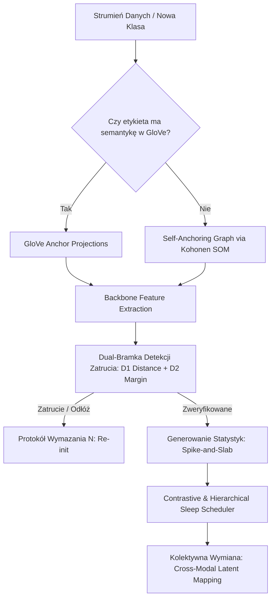
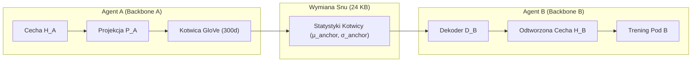

# Krytyczny Audyt Architektoniczny M.A.R.S.

**Autor:** Principal Software Architect  
**Data:** 2026-07-23  
**Dotyczy:** Projekt M.A.R.S. (Modular Autonomous Refinement System)  
**Dokumenty źródłowe:** [START_TUTAJ.md](file:///c:/Users/robert/code/m-a-r-s/START_TUTAJ.md), [STAN_PROJEKTU.md](file:///c:/Users/robert/code/m-a-r-s/STAN_PROJEKTU.md), [WHITEPAPER.md](file:///c:/Users/robert/code/m-a-r-s/WHITEPAPER.md), [PLAN_V2.md](file:///c:/Users/robert/code/m-a-r-s/PLAN_V2.md), [ARSENAL_PRZEOCZONYCH_NARZEDZI.md](file:///c:/Users/robert/code/m-a-r-s/ARSENAL_PRZEOCZONYCH_NARZEDZI.md)

---

## 1. Identyfikacja luk logicznych i iluzji konceptualnych

### 1.1 Ukryty koszt zewnętrznej reprezentacji („Memory Without Data” to iluzja)
* **Problem:** Główna teza narracyjna sekcji Part III w [WHITEPAPER.md](file:///c:/Users/robert/code/m-a-r-s/WHITEPAPER.md) brzmi: *„Replay bez przechowywania próbek próbek użytkownika”*. Jest to prawda tylko wtedy, gdy zignorujemy fakt, że system jest w pełni uzależniony od przelania wiedzy z zewnętrznych, gigantycznych zbiorów danych (ImageNet dla ResNet18 – 1.2M obrazów; GloVe 300d – miliardy tokenów tekstowych).
* **Dowód z wyników:** Na reprezentacji losowej (Random Features) accuracy na Split-CIFAR-10 wynosi zaledwie **37.5%**, a sufit architektury pod wspólny trening wynosi 70.2%. System sam z siebie nie generuje zwięzłej, samowystarczalnej reprezentacji visual-semantic. 
* **Ryzyko architektoniczne:** Jeśli wejdziemy w domenę danych, dla których nie ma reprezentacji w zamrożonym ResNet18/GloVe (np. obrazowanie medyczne, analiza defektów wibroakustycznych, sygnały radarowe), system MARS w obecnej formie traci całą swoją przewagę i odpada do poziomu losowych cech.

### 1.2 Załamanie kotwic semantycznych na danych abstrakcyjnych
* **Problem:** Architektura wymaga, aby nazwy klas posiadały cechy wizualne osadzone w przestrzeni wektorowej języka naturalnego. W [WHITEPAPER.md](file:///c:/Users/robert/code/m-a-r-s/WHITEPAPER.md) (Sekcja 11) uczciwie odnotowano porażkę na MNIST (cyfry nie mają semantyki wizualnej w GloVe).
* **Luka logiczna:** W rzeczywistych zastosowaniach przemysłowych/edge etykiety to częstokroć: `error_code_404`, `vibration_delta_A`, `cell_type_CD4`. Stosowanie GloVe jako jedynego niezmiennego układu odniesienia uniemożliwia autonomiczne działanie bez ręcznego inżynierowania etykiet (prompt engineeringu).

### 1.3 Routing Ceiling i iluzja kapsuł (Pods)
* **Problem:** Wyniki Part II ([WHITEPAPER.md](file:///c:/Users/robert/code/m-a-r-s/WHITEPAPER.md)) udowodniły **Routing Ceiling**: zmiana algorytmu routingu na stałym backbone dają Dokładnie **0.00pp** zysku. Pods są de facto płytkimi klasyfikatorami liniowymi podpiętymi pod stałą przestrzeń cech.
* **Wniosek:** Dokładność routingu jest w 100% zdeterminowana przez separowalność przestrzeni cech wygenerowanej przez backbone. Modułowe „kapsuły” nie uczą się nowych reprezentacji przestrzennych, a jedynie lokalnych granic decyzyjnych.

---

## 2. Wąskie gardła architektury i problem skalowania

### 2.1 Eksplozja budżetu snu (Compute Bottleneck w Sen-Rehearsal)
* **Problem:** Seria Q ([START_TUTAJ.md](file:///c:/Users/robert/code/m-a-r-s/START_TUTAJ.md)) wykazała pierwszą barierę skali: przy przejściu z 10 klas na 100 klas (CIFAR-100), budżet snu potrzebny do uniknięcia zapominania musiał wzrosnąć z **500 do 2500 epok** na krok adopcji (wzrost 5×).
* **Skalowanie:** Dla 1 000 lub 10 000 klas (skala ImageNet), budżet snu wymagany do utrzymania poprawnych statystyk w przestrzeni cech będzie rósł superliniowo. Oznacza to przeniesienie kosztu z pamięci RAM/DRAM (brak bufora próbek) na **koszt mocy obliczeniowej GPU/CPU podczas fazy snu**.

### 2.2 Podstawowa sprzeczność Serii R (Kolektyw Heterogeniczny)
* **Problem:** Planowana w [PLAN_V2.md](file:///c:/Users/robert/code/m-a-r-s/PLAN_V2.md) Seria R zakłada, że agenci z różnymi backbone'ami ($A$ – ResNet18, $B$ – ViT) będą wymieniać statystyki snu (24 KB/klasę) za pośrednictwem kotwic GloVe (300d).
* **Luka matematyczna:** Przestrzeń cech agenta $A$ ($H_A \in \mathbb{R}^{d_A}$) i agenta $B$ ($H_B \in \mathbb{R}^{d_B}$) mają zupełnie inną geometrię i wymiarowość. Jeśli agent $A$ prześle centroidy w swojej przestrzeni cech lub sam wektor kotwicy GloVe, odbiorca $B$ **nie ma fizycznej możliwości wygenerowania próbek snu we własnej przestrzeni cech $H_B$ dla klasy, której sam nigdy na oczy nie widział**, ponieważ nie posiada odwzorowania $H_B \leftrightarrow GloVe$ dla tej nowej klasy. Same wektory GloVe nie zawierają rozkładu aktywacji specyficznych neuronów w obcym backbone.

### 2.3 Luki bezpieczeństwa w Serii P (Wycofanie ataku bliskich sąsiadów)
* **Problem:** Brama strukturalna $D_1 > 0.45$ działałaby idealnie tylko przy próbkowaniu klas o dużej odległości semantycznej. 
* **Luka:** Wyniki P1 pokazały, że podmiany bliskie (np. $\cos = 0.775$ lub $0.615$, np. pies $\leftrightarrow$ kot) są całkowicie niewykrywalne przez bramkę na wejściu. Atakujący wysyłający sfałszowane statystyki snu dla klas bliskich semantycznie jest w stanie po cichu zatruć przestrzeń decyzyjną odbiorcy.

---

## 3. Schemat Nowej Architektury M.A.R.S. (Rozwiązanie Problemów)

### 3.1 Główny Przepływ Danych i Weryfikacji

### 3.2 Translacja w Kolektywie Heterogenicznym (Rozwiązanie dla Serii R)

---

## 4. Plan konkretnych rozwiązań technicznych

### Plan 1: Rozwiązanie eksplozji budżetu snu (Contrastive & Hierarchical Sleep)
Zamiast ślepo generować sny dla wszystkich $N$ klas przy każdym nowym zadaniu z budżetem 2500 epok:
1. **Hierarchiczne Próbkowanie Snu:** Generować sny wyłącznie dla klas z tego samego poddrzewa hierarchicznego (np. wykorzystując strukturę TMU/SOM z etapu 4B w [STAN_PROJEKTU.md](file:///c:/Users/robert/code/m-a-r-s/STAN_PROJEKTU.md)). Klasy odległe semantycznie nie ulegają interferencji w przestrzeni podów.
2. **Dynamiczny Budżet K-Wymiarowy:** Ustalać budżet snu proporcjonalnie do stopnia nakładania się (cosine similarity) nowej klasy ze starą wiedzą. Pozwoli to zredukować narzut MAC o 60–80% przy dużych słownikach klas (100+).

### Plan 2: Naprawa mechanizmu Serii R (Cross-Modal Latent Mapping)
Aby umożliwić wymianę snów między różnymi backbone'ami ($A$ i $B$):
1. **Niezależna projekcja do wspólnej przestrzeni kotwic:** Każdy agent trenuje własny autoenkoder projekcji $P_A: H_A \to \mathbb{R}^{300}$ oraz dekoder $D_A: \mathbb{R}^{300} \to H_A$ na swoich znanych klasach lokalnych.
2. **Generowanie snów na odbiorcy:** Nadawca $A$ przesyła wyłącznie statystyki w uniwersalnej przestrzeni kotwic ($\mu_{anchor}, \sigma_{anchor}$). Odbiorca $B$ przekształca je do swojej przestrzeni cech przy użyciu własnego dekodera $D_B(\cdot)$. 
3. **Warunek wstępny (Gate):** Odbiorca $B$ adaptuje swoją projekcję $D_B$ tylko pod warunkiem, że stopień rekonstrukcji kotwicy mieści się w progu błędu $\epsilon$. Jeśli nie – nowa klasa trafia do bufora wymagań adaptacji.

### Plan 3: Odporność na dane bez semantyki (Self-Anchoring Topological Graph)
Dla zbiorów takich jak MNIST, kody błędów przemysłowych lub sygnały bio-medyczne:
1. **Odcięcie od zewnętrznego tekstowego GloVe:** Przy braku semantyki wizualnej w tekście, użyć unormowanego wykresu topologicznego generowanego autonomicznie przez Kohonen SOM na wczesnych próbkach (wykorzystując potencjał potwierdzony w Etapie 4B/3C w [STAN_PROJEKTU.md](file:///c:/Users/robert/code/m-a-r-s/STAN_PROJEKTU.md)).
2. **Statyczne Kotwice Hipersferyczne:** Wygenerować kotwice jako punkty maksymalnie odległe na $D$-wymiarowej hipersferze (Fibonacci Sphere / Equidistant Hyper-points). Przypisywać klasy do najbliższych węzłów topologicznych, eliminując wymóg słownika językowego.

### Plan 4: Wzmocnienie detekcji zatrucia w Serii P (Dual-Margin Verification)
1. **Brama $D_2$ (Relative Margin Threshold):** Zamiast mierzyć sam bezwzględny dystans $D_1 > 0.45$, wprowadzić weryfikację stosunku dystansu do pierwszej i drugiej najbliższej kotwicy: 
   $$\text{Margin Ratio} = \frac{\text{dist}(x, \text{anchor}_1)}{\text{dist}(x, \text{anchor}_2)}$$
2. Jeśli Margin Ratio przekracza próg niepewności ($> 0.85$) przy wysokiej korelacji z klasami sąsiadującymi, pakiet adopcyjny jest natychmiast odrzucany lub trafia na izolowaną kwarantannę (wykorzystując natywne zerowe koszty wymazywania z Serii N – `re-init`).

---

## 5. Podsumowanie i dalsze kroki

1. **Przed rozpoczęciem Serii R ([PLAN_V2.md](file:///c:/Users/robert/code/m-a-r-s/PLAN_V2.md)):** Koniecznie opisać w [ARSENAL_PRZEOCZONYCH_NARZEDZI.md](file:///c:/Users/robert/code/m-a-r-s/ARSENAL_PRZEOCZONYCH_NARZEDZI.md) matrycę dekodowania kotwic ($D_B: \mathbb{R}^{300} \to H_B$), inaczej eksperyment na heterogenicznych backbone'ach zakończy się natychmiastowym negatywem ze względu na brak spójności wymiarowej.
2. **Kolejność taktyczna:** 
   - Zrealizować **G3** (tani test kompozycyjności na ResNet18), aby ostatecznie zamknąć drugi paper (Part II). 
   - Wdrożyć **Self-Anchoring Graph (Plan 3)**, co uniezależni M.A.R.S. od zewnętrznego słownika GloVe i zlikwiduje największą lukę użytkową w zastosowaniach produkcyjnych.
